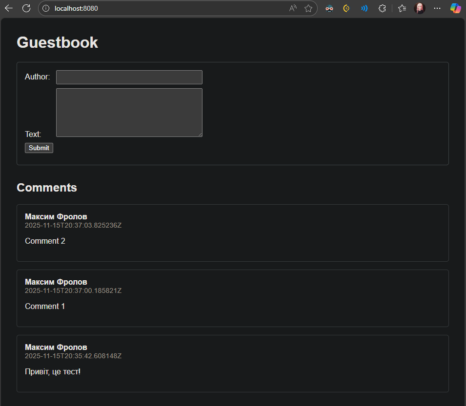
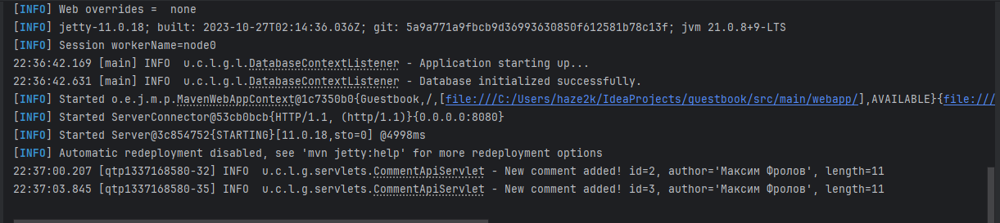

# Лабораторна робота: "Книга відгуків" (Maven + Jetty + JDBC/H2)

Простий веб-додаток "Книга відгуків", реалізований з використанням Jakarta Servlets,
запущений на вбудованому сервері Jetty та зі збереженням даних у H2.

## 🛠️ Технічні деталі

* **JDK:** 21 (Eclipse Temurin 21.0.8)
* **Maven:** 3.x (той, що вбудований в IDEA)
* **Сервер:** Jetty 11.0.18
* **База даних:** H2 (файлова)

## 🚀 Команда запуску

Для запуску проекту виконайте у терміналі з кореня проекту:

```bash
mvn jetty:run
Або через IntelliJ IDEA: Maven -> Plugins -> jetty -> jetty:run

Після успішного запуску, додаток доступний за адресою: http://localhost:8080/

📁 База даних
H2 URL: jdbc:h2:file:./data/guest;AUTO_SERVER=TRUE

Файл БД: data/guest.mv.db (створюється у корені проекту при першому запуску)

🌐 Ендпоїнти (Endpoints)
GET /

Віддає головну HTML-сторінку з формою додавання та списком усіх відгуків.

POST /comments

Приймає author (String, max 64) та text (String, max 1000).

Успіх: 204 No Content.

Помилки: 400 Bad Request (валідація), 500 Internal Server Error (збій БД).

GET /comments

Віддає application/json список усіх коментарів (новіші зверху).
```

📸 Скріншоти





